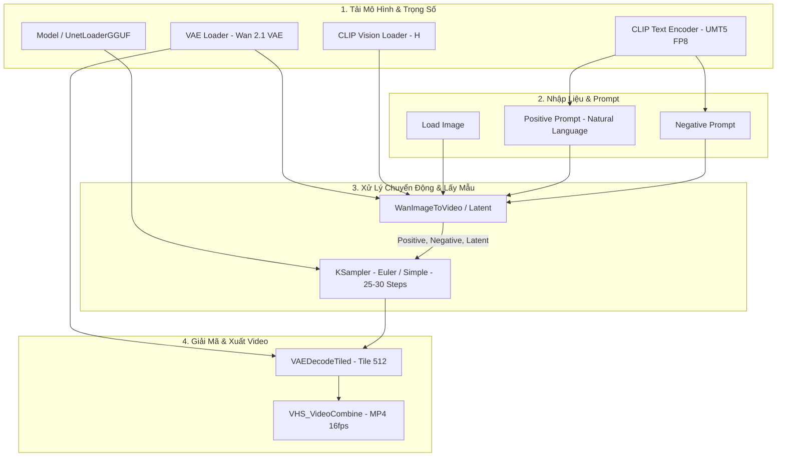

# 🎬 Cẩm Nang Sử Dụng ComfyUI Workflows (Wan 2.1)
### Hướng dẫn chi tiết sản xuất Video AI cho YouTube Faceless, Shorts & TikTok trên Google Colab

Tài liệu này hướng dẫn chi tiết cách khai thác tối đa 4 bộ Workflow ComfyUI chuyên dụng được tối ưu hóa cho mô hình **Wan 2.1** trên Google Colab Free (Tesla T4 GPU 15GB VRAM).

---

## 📌 Danh Sách 4 Bộ Workflow

| Tên File | Loại Hình | Mục Đích Sử Dụng | Thời Gian Render (T4) |
| :--- | :--- | :--- | :--- |
| **Wan2_1_14B_GGUF_I2V_Workflow.json** ⭐ | **Image-to-Video (14B)** | **[Chất lượng cao nhất trên T4]** Bản 14B lượng tử hóa Q4_K_M cân bằng hoàn hảo giữa chi tiết khuôn mặt, chuyển động điện ảnh và VRAM. | ~3 – 4 phút / video |
| **Wan2_1_I2V_Workflow.json** | **Image-to-Video (1.3B)** | Biến ảnh tĩnh thành video với tốc độ siêu nhanh, phù hợp sản xuất hàng loạt clip Shorts / TikTok. | ~1 – 2 phút / video |
| **Wan2_1_T2V_Workflow.json** | **Text-to-Video (1.3B)** | Tạo video trực tiếp từ câu lệnh mô tả văn bản (Prompt), không cần ảnh gốc. | ~1 – 2 phút / video |
| **Wan2_1_FLF2V_Workflow.json** | **First / Last Frame** | Tạo chuyển cảnh biến đổi hình thái (Morphing Transition) giữa ảnh bắt đầu và ảnh kết thúc. | ~2 – 3 phút / video |

---

## 🏗️ Sơ Đồ Kiến Trúc Luồng Dữ Liệu (Workflow Pipeline)



---

## 📐 Bảng Kích Thước & Thông Số Kỹ Thuật Chuẩn

### 1. Kích thước (Resolution):
* **YouTube Ngang (16:9):** Width: `832` | Height: `480`
* **Shorts / TikTok / Reels Dọc (9:16):** Width: `480` | Height: `832`
* **Video Vuông (1:1):** Width: `640` | Height: `640`

> 💡 **Lưu ý:** Wan 2.1 sinh video nền ở độ phân giải 480p để đảm bảo độ mượt và thời gian sinh hợp lý trên GPU phổ thông. Không nên tự ý gõ kích thước quá lớn (như 1080p trực tiếp trên Wan) vì sẽ gây tràn bộ nhớ (CUDA Out of Memory) hoặc méo vật lý chuyển động.

### 2. Quy tắc số khung hình ($4n + 1$) & Thời lượng:
Do bộ giải mã VAE của Wan nén thời gian theo tỷ lệ $4\times$, số khung hình hợp lệ bắt buộc phải tuân theo công thức $4n + 1$:
* **33 frames:** ~2.06 giây *(dùng để test thử nghiệm nhanh ý tưởng)*.
* **49 frames:** ~3.06 giây *(chuẩn vàng cho các shot video ngắn YouTube/TikTok)*.
* **65 frames:** ~4.06 giây *(cho chuyển động dài hoặc lia camera rộng)*.
* **81 frames:** ~5.06 giây *(độ dài mặc định tối đa của Wan)*.

### 3. Cài đặt KSampler:
* **Steps:** 25 – 30 steps (đối với bản 14B) hoặc 20 – 25 steps (đối với bản 1.3B).
* **CFG Scale:** 5.0 – 6.0 (giữ nguyên tắc cân bằng, tránh hiện tượng cháy màu/răng cưa).
* **Sampler Name:** `euler` hoặc `uni_pc`.
* **Scheduler:** `simple`.
* **Frame Rate (FPS):** Đặt `16` trong node `VHS_VideoCombine` (tốc độ sinh gốc của mô hình Wan 2.1).

---

## ✍️ Công Thức Viết Prompt Tối Ưu Cho Bộ Mã Hóa UMT5-XXL

Mô hình Wan 2.1 sử dụng bộ mã hóa ngôn ngữ **UMT5-XXL**, có khả năng hiểu các câu văn mô tả ngữ nghĩa tự nhiên tiếng Anh và tiếng Trung rất tốt. Tránh nhồi nhét các từ khóa rời rạc kiểu Stable Diffusion 1.5 (`masterpiece, 8k, best quality`).

### 🟢 Cấu trúc Positive Prompt Chuẩn:
> **[Chủ thể & Bối cảnh] + [Hành động / Chuyển động của chủ thể] + [Chuyển động Camera] + [Ánh sáng & Chi tiết môi trường]**

* **Mẫu Chân dung Nhân vật (Portrait Motion):**
  ```text
  A young woman standing near a window, slowly turns her head to look into the camera with a gentle smile, soft natural breeze blowing her hair, cinematic slow push-in camera movement, warm volumetric sunlight streaming through curtains, high fidelity natural motion.
  ```

* **Mẫu Phong cảnh / Xe cộ / Drone Shot:**
  ```text
  A sleek sports car cruising along a scenic coastal highway at sunset, smooth low-angle tracking shot moving alongside the car, golden hour reflections shimmering on the vehicle surface, dynamic ocean waves crashing in the background.
  ```

* **Mẫu Chuyển cảnh Biến hình (FLF2V Transition):**
  ```text
  A seamless cinematic camera transition gracefully morphing from the first scene into the second scene, fluid motion dynamics, consistent atmospheric lighting, smooth spatial progression.
  ```

### 🔴 Cấu trúc Negative Prompt Chuẩn:
> Đặt sẵn trong ô Negative Prompt để ngăn chặn các lỗi hình thái học:
```text
blurry, static, distortion, deformed hands, bad anatomy, low quality, jitter, watermark, oversaturated, unnatural morphing, sudden camera jump, flickering artifacts
```

---

## 🚀 Quy Trình Sản Xuất Video Faceless 5 Bước Chuẩn Production

1. **Ý tưởng & Kịch bản:** Dùng **ChatGPT / Claude / Gemini** viết kịch bản Shorts 30-45 giây (chia thành 6 - 8 câu đơn, mỗi câu tương ứng 1 shot hình).
2. **Giọng đọc (Voiceover):** Dùng **Kokoro TTS** hoặc **Edge-TTS** tạo file âm thanh đọc tự nhiên.
3. **Tạo ảnh gốc (Base Visuals):** Dùng **FLUX.1** hoặc **Midjourney** tạo ảnh tĩnh sắc nét theo từng câu trong kịch bản.
4. **Tạo chuyển động AI:** Tải ảnh vào **Wan 2.1 ComfyUI** (chọn bản 14B GGUF cho shot mở đầu/hero shot, và bản 1.3B cho các shot phụ) để render thành các clip 3 giây.
5. **Hậu kỳ & Xuất bản (Post-Processing):**
   * Đưa video vào phần mềm dựng (CapCut, DaVinci Resolve hoặc Premiere Pro).
   * **Nội suy khung hình (Interpolation):** Tăng tốc độ từ 16 FPS lên 30 FPS hoặc 60 FPS để video mượt mà tuyệt đối.
   * **AI Upscale:** Bật tính năng Video Upscale lên 1080p / 4K.
   * Thêm phụ đề tự động (Auto Captions), hiệu ứng âm thanh (SFX) và nhạc nền!

---

## 🛠️ Hướng Dẫn Khắc Phục Sự Cố Thường Gặp

| Hiện tượng | Nguyên nhân | Cách khắc phục |
| :--- | :--- | :--- |
| **Giao diện web bị đơ ở Bước 3 (viền hồng)** | WebSocket bị ngắt kết nối do frontend cũ hoặc chưa chọn ảnh đầu vào. | Nhấn `Ctrl + F5` trên trình duyệt. Chọn ảnh thật trong node `Load Image` rồi bấm `Queue Prompt`. Nếu cần, khởi động lại Runtime trên Colab. |
| **Lỗi `HTTP 400 Bad Request`** | Thiếu file ảnh đầu vào hoặc tên file không tồn tại. | Đảm bảo node `Load Image` đã chọn 1 file ảnh hợp lệ. Notebook phiên bản mới đã tự tạo sẵn file ảnh mẫu chống lỗi này. |
| **Video bị giật / nhảy khung hình** | Đặt số frames không theo quy tắc $4n+1$. | Chỉ đặt số frames là `33`, `49`, `65`, hoặc `81`. |
| **Video bị cháy màu / méo nét** | CFG đặt quá cao (> 7.0) hoặc prompt quá nhiều từ khóa rác. | Hạ CFG về mức chuẩn `5.0 - 6.0` và viết prompt theo văn phong tự nhiên. |
